# Prepper Bunker Management System

This project serves as a learning platform for students to develop full-stack applications using Quarkus and Angular Renaissance. The application simulates a resource management system for a prepper bunker, tracking various resources like weapons, ammunition, food, drinks, medications, fuel, and more.

## Project Overview

The Prepper Bunker Management System consists of:

1. **Backend**: A RESTful API built with Quarkus
2. **Frontend**: A modern UI built with Angular Renaissance and Angular Material

## Technology Stack

### Backend (Quarkus)

- **quarkus-hibernate-orm-panache**: Simplified ORM and repository management
- **quarkus-rest-jackson**: JSON serialization/deserialization
- **quarkus-jdbc-h2**: In-memory database
- **quarkus-smallrye-openapi**: API documentation

### Frontend (Angular Renaissance)

- **@angular/material**: Material Design components
- **HttpClient**: API communication
- **SCSS**: Advanced styling

## Database Structure

The application uses the following database schema:

```mermaid
---
config:
  theme: forest
---
erDiagram
    storage_location {
        BIGINT id PK "GENERATED BY DEFAULT AS IDENTITY"
        VARCHAR name
        VARCHAR description
    }
    ammunition_type {
        BIGINT id PK "GENERATED BY DEFAULT AS IDENTITY"
        VARCHAR caliber
        VARCHAR type
    }
    weapon {
        BIGINT id PK "GENERATED BY DEFAULT AS IDENTITY"
        VARCHAR type
        VARCHAR model
        INT quantity
        BIGINT ammunition_type_id FK
        BIGINT storage_location_id FK
    }
    ammunition_stock {
        BIGINT id PK "GENERATED BY DEFAULT AS IDENTITY"
        BIGINT ammunition_type_id FK
        INT quantity
        BIGINT storage_location_id FK
    }
    drink {
        BIGINT id PK "GENERATED BY DEFAULT AS IDENTITY"
        VARCHAR type
        DOUBLE quantity
        DATE expiration_date
        BIGINT storage_location_id FK
    }
    food {
        BIGINT id PK "GENERATED BY DEFAULT AS IDENTITY"
        VARCHAR type
        DOUBLE quantity
        DATE expiration_date
        BIGINT storage_location_id FK
    }
    medication {
        BIGINT id PK "GENERATED BY DEFAULT AS IDENTITY"
        VARCHAR name
        INT quantity
        DATE expiration_date
        VARCHAR purpose
        BIGINT storage_location_id FK
    }
    fuel_type {
        BIGINT id PK "GENERATED BY DEFAULT AS IDENTITY"
        VARCHAR name
    }
    fuel {
        BIGINT id PK "GENERATED BY DEFAULT AS IDENTITY"
        BIGINT fuel_type_id FK
        DOUBLE quantity
        BIGINT storage_location_id FK
    }
    battery {
        BIGINT id PK "GENERATED BY DEFAULT AS IDENTITY"
        VARCHAR type
        DOUBLE capacity
        INT quantity
        BIGINT storage_location_id FK
    }
    generator {
        BIGINT id PK "GENERATED BY DEFAULT AS IDENTITY"
        VARCHAR type
        DOUBLE power
        BIGINT fuel_type_id FK
        VARCHAR status
        BIGINT storage_location_id FK
    }
    weapon ||--o{ ammunition_type : "uses"
    weapon ||--o{ storage_location : "stored at"
    ammunition_stock ||--o{ ammunition_type : "is for"
    ammunition_stock ||--o{ storage_location : "stored at"
    drink ||--o{ storage_location : "stored at"
    food ||--o{ storage_location : "stored at"
    medication ||--o{ storage_location : "stored at"
    fuel ||--o{ fuel_type : "is"
    fuel ||--o{ storage_location : "stored at"
    battery ||--o{ storage_location : "stored at"
    generator ||--o{ fuel_type : "runs on"
    generator ||--o{ storage_location : "stored at"
```

The database is initialized with sample data using the [import.sql](prepper-bunker-backend/src/main/resources/import.sql) file.

## Project Structure

- `/templates`: Empty starter templates for students to begin implementation
- `/prepper-bunker-backend`: Completed Quarkus backend implementation
- `/prepper-bunker-frontend`: Completed Angular Renaissance frontend implementation

## Learning Objectives

This project is designed to help students:

1. Understand RESTful API design with Quarkus
2. Work with JPA and Panache for database operations
3. Develop modern UIs with Angular Renaissance and Material Design
4. Implement CRUD operations and data validation
5. Create a cohesive full-stack application

## Getting Started

### Backend Setup

1. Navigate to `/prepper-bunker-backend`
2. Run `./mvnw quarkus:dev` to start the development server
3. Access the OpenAPI documentation at `http://localhost:8080/q/openapi`

### Frontend Setup

1. Navigate to `/prepper-bunker-frontend`
2. Run `npm install` to install dependencies
3. Run `npm run dev` to start the development server
4. Access the application at `http://localhost:4200`

## Additional Resources

- [Quarkus Guides](https://quarkus.io/guides)
- [Angular Documentation](https://v17.angular.io/docs)
- [Angular Material](https://v17.material.angular.io)
